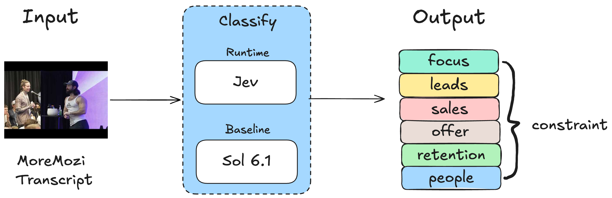

# Mozi Evals

Classify the primary business constraint in a complete MoreMozi transcript. Jev labels 500 videos; GPT-6.1 Sol provides the baseline. The six labels are Focus, Leads, Sales, Offer, Retention, and People.



## Run locally

Create the environment and download the transcript snapshot:

```sh
uv venv --python 3.12 .venv
uv pip install --python .venv/bin/python -r requirements.txt
.venv/bin/python eval/sync_transcripts.py
```

The corpus is saved to `data/ask-hormozi/` and excluded from Git. Use `--ref COMMIT_SHA` with the sync command to fetch a specific upstream snapshot.

Add `OPENROUTER_API_KEY` to `.env`, then start the local site:

```sh
.venv/bin/python eval/server.py
```

Open [http://127.0.0.1:8765/#classify](http://127.0.0.1:8765/#classify) and select **Run Jev**. Set `JEV_WORKERS` in `.env` to adjust concurrency (1–32; default 32). API keys stay on the local server.

To run from the terminal instead:

```sh
.venv/bin/python eval/jev_runner.py --run
```

Progress is checkpointed in `.eval-runs/jev-progress.json`; a complete run writes `dist/jev_report.json`.

## Baseline

The baseline prompt and label definitions are in `dist/baseline_spec.json`. Run it through Codex CLI:

```sh
.venv/bin/python eval/codex_baseline_runner.py --run --workers 8
```

Each transcript gets an isolated Codex session. Progress and session details are saved under `.eval-runs/`; the completed report is `dist/baseline_report.json`.

## Data and references

The 500-video set keeps 100 curated cases and adds the 400 highest-scoring screened cases. Selection metadata and scores are in `dist/manifest.json` and `dist/advice_screen_report.json`. The 10 hand-labeled reference cases are unchanged; other labels are not provided as ground truth.
